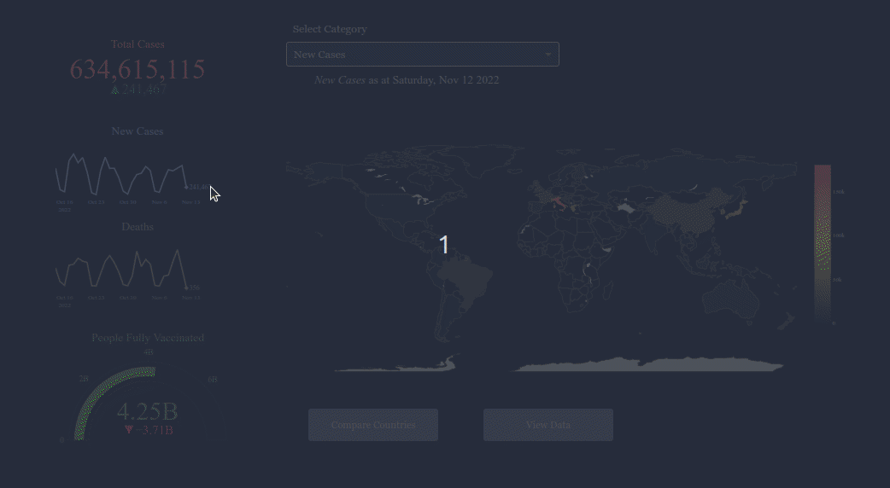

# COVID-19 Global Dashboard

Track COVID-19 cases worldwide.

[](https://github.com/Tim-Abwao/covid19-global-dashboard/actions/workflows/data.yml)
[](https://github.com/Tim-Abwao/covid19-global-dashboard/actions/workflows/test.yml)

## Updates:

### 28 April 2023

>Archiving this repository. Some of data sources have been archived. And so many projects serving a similar purpose exist. Diverting energies to new projects.

1. View global metrics:

   

2. Compare the situation among countries:

   

Built with [Dash][dash]. [Available online][live_app] for free courtesy of [Render][render].

>**NOTE:** Free-hosted apps might take a while to load since they are shut down when not in use.

The data is obtained from:

* [Our World in Data  COVID-19 data repository][owid]
* [JHU CSSE COVID-19 data repository][jhucsse]

## Running Locally

> **NOTE:** Requires **python3.10 and above**

1. Download the code, and create a virtual environment:

    ```bash
    git clone https://github.com/Tim-Abwao/covid19-global-dashboard.git
    cd covid19-global-dashboard
    python3 -m venv venv
    source venv/bin/activate
    ```

2. Install the required packages:

    ```bash
    pip install -U pip
    pip install -r requirements.txt
    ```

3. Launch the dashboard server:

    ```bash
    waitress-serve covid19_dash:server
    ```

Afterwards, browse to <http://localhost:8080>.

[dash]: https://plotly.com/dash/
[owid]: https://github.com/owid/covid-19-data/tree/master/public/data
[jhucsse]: https://github.com/CSSEGISandData/COVID-19
[render]: https://render.com/
[live_app]: https://covid19-global-dashboard.onrender.com/
