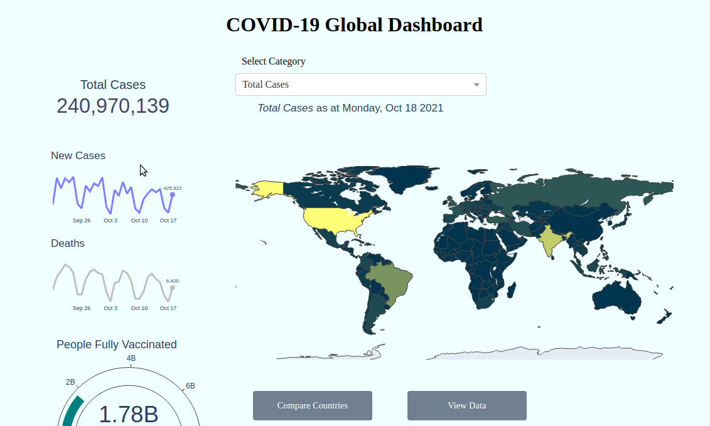

# COVID-19 Global Dashboard

Track COVID-19 cases worldwide.

[](https://github.com/Tim-Abwao/covid19-global-dashboard/actions/workflows/data.yml)

1. View global metrics:

    [][live_app]

2. Compare the situation among Countries:

    [][live_app]

Built with [Dash][dash].

The data is obtained from:

* [Our World in Data  COVID-19 data repository][owid]
* [JHU CSSE COVID-19 Data repository][jhucsse]


## Running locally

1. Download the code, and create a virtual environment:

    ```bash
    git clone https://github.com/Tim-Abwao/covid19-global-dashboard.git
    cd covid19-global-dashboard
    python3 -m venv venv
    source venv/bin/activate
    ```

2. Install the required packages:

    ```bash
    pip install -U pip
    pip install -r requirements.txt
    ```

3. Launch the dashboard server:

    ```bash
    waitress-serve cov19_dash:server
    ```

[dash]: https://plotly.com/dash/
[owid]: https://github.com/owid/covid-19-data/tree/master/public/data
[jhucsse]: https://github.com/CSSEGISandData/COVID-19
[live_app]: https://covid19-global-dash.herokuapp.com/
